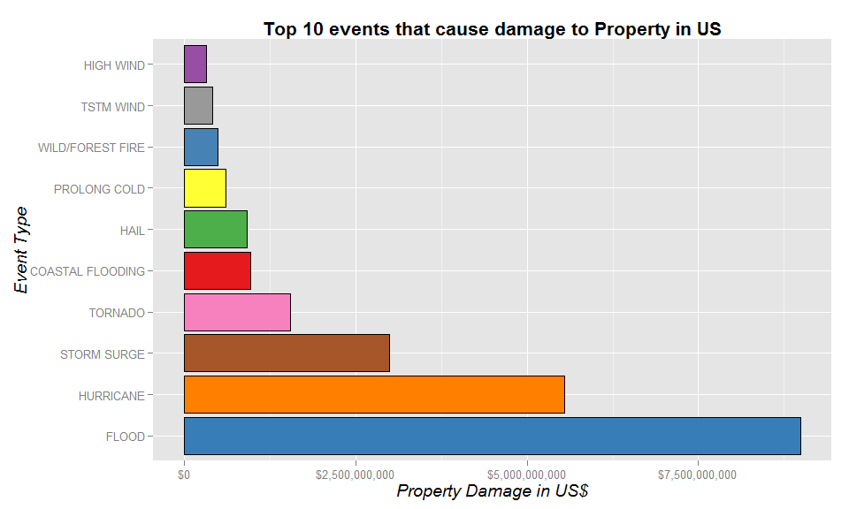

# US Storms : Determination of events most harmful to humans and economy
  <br>    
      

## Synopsis
***
   
The U.S. National Oceanic and Atmospheric Administration's (NOAA) storm database was analysed to determine which events are most harmful to humans in terms of the number of deaths and injuries caused by them, and events which cause greatest damage to property and crops in dollar terms. The top ten most harmful events were recognised on the basis of average damage caused per year for each event. Excessive heat and Tornado were found to be most harmful for the lives of humans. Flood, Downburst, and Hurricane were found to have been the greatest cause of economic damage.   


## Data Processing
The U.S. National Oceanic and Atmospheric Administration's (NOAA) storm database tracks characteristics of major storms and weather events in the United States, including when and where they occur, as well as estimates of any fatalities, injuries, damage to property and crops. The data can be found [here](https://d396qusza40orc.cloudfront.net/repdata%2Fdata%2FStormData.csv.bz2)   
Other details regarding the data can be found on their [website](https://www.ncdc.noaa.gov/stormevents/details.jsp).  
   
Let us get to the data.   

```r
require(data.table)
require(ggplot2)
require(RColorBrewer)
require(scales)
require(pander)
require(stringdist)
require(R.utils)

panderOptions('big.mark',',') # separate big numbers with commas.
panderOptions('table.split.table',Inf) # don't split tables. EVER.
panderOptions('round',2) # also to prevent scientific notation, one should work.
panderOptions("table.style","rmarkdown") # for better look on github
options("scipen"=999) # prevent scientific notation from rearing its ugly head.

## Commented out bunzip command to prevent numerious unzipping sessions
## each time I knit but do this the first time.

# bunzip2("StormData.csv.bz2",remove = FALSE)
test <- read.csv("StormData.csv",nrows = 20)
names(test)
```

```
##  [1] "STATE__"    "BGN_DATE"   "BGN_TIME"   "TIME_ZONE"  "COUNTY"    
##  [6] "COUNTYNAME" "STATE"      "EVTYPE"     "BGN_RANGE"  "BGN_AZI"   
## [11] "BGN_LOCATI" "END_DATE"   "END_TIME"   "COUNTY_END" "COUNTYENDN"
## [16] "END_RANGE"  "END_AZI"    "END_LOCATI" "LENGTH"     "WIDTH"     
## [21] "F"          "MAG"        "FATALITIES" "INJURIES"   "PROPDMG"   
## [26] "PROPDMGEXP" "CROPDMG"    "CROPDMGEXP" "WFO"        "STATEOFFIC"
## [31] "ZONENAMES"  "LATITUDE"   "LONGITUDE"  "LATITUDE_E" "LONGITUDE_"
## [36] "REMARKS"    "REFNUM"
```
<br>
The data contains 37 variables, out of which we are only interested in a few regarding the date of the event, the type of event, and the human and economic damage caused by the event. So let us load the complete data for those variables.  
<br>   


```r
cols <- c(2,8,23:28)
origin <- fread(input = "StormData.csv",sep = ",",header = TRUE,select = cols)
```

```
## 
Read 0.0% of 967216 rows
Read 38.3% of 967216 rows
Read 69.3% of 967216 rows
Read 93.1% of 967216 rows
Read 902297 rows and 8 (of 37) columns from 0.523 GB file in 00:00:16
```

```
## Warning in fread(input = "StormData.csv", sep = ",", header = TRUE, select
## = cols): Read less rows (902297) than were allocated (967216). Run again
## with verbose=TRUE and please report.
```

```r
origin
```

```
##                   BGN_DATE     EVTYPE FATALITIES INJURIES PROPDMG
##      1:  4/18/1950 0:00:00    TORNADO          0       15    25.0
##      2:  4/18/1950 0:00:00    TORNADO          0        0     2.5
##      3:  2/20/1951 0:00:00    TORNADO          0        2    25.0
##      4:   6/8/1951 0:00:00    TORNADO          0        2     2.5
##      5: 11/15/1951 0:00:00    TORNADO          0        2     2.5
##     ---                                                          
## 902293: 11/30/2011 0:00:00  HIGH WIND          0        0     0.0
## 902294: 11/10/2011 0:00:00  HIGH WIND          0        0     0.0
## 902295:  11/8/2011 0:00:00  HIGH WIND          0        0     0.0
## 902296:  11/9/2011 0:00:00   BLIZZARD          0        0     0.0
## 902297: 11/28/2011 0:00:00 HEAVY SNOW          0        0     0.0
##         PROPDMGEXP CROPDMG CROPDMGEXP
##      1:          K       0           
##      2:          K       0           
##      3:          K       0           
##      4:          K       0           
##      5:          K       0           
##     ---                              
## 902293:          K       0          K
## 902294:          K       0          K
## 902295:          K       0          K
## 902296:          K       0          K
## 902297:          K       0          K
```

The data is read through the data.table library. The data gives warning regarding less records read than existed. This is because, the fread command, in its calculation of number of rows uses the total count of "separator" in its formula. The separator in our case is "," (comma). Since the data also contains a variable `REMARKS`, which contains event narratives(written in couple of sentences in general) and employs commas inside it, the formula throws a warning. It is nothing to worry about.   

Further exploration of the data reveals a number of problems.   
First of all, the EVTYPE variable, which is supposed to only describe 48 official events has close to a thousand unique events. Mostly due to slight changes in spellings or names (Tornado and Tornados are considered different for example).  

Furthermore, PROPDMGEXP and CROPDMGEXP are supposed to have an alphabetical character that gives the magnitude of the damage (K for thousand, M for million and so on), however, it contains various other characters such as (+,-,?,0,1,2) etc. So first of all let us subset the records with only proper characters in these two variables.  

Also, the website describes that for the period 1950-1955, only Tornado data was collected, and for the period 1955-1996, only Tornado, Thunderstorm Wind, and Hail data was collected. It was only after 1996, that the data regarding all 48 events was recorded.    
    
    
Clearly using the whole data would create a bias towards these few events (46 years worth of extra data regarding only a handful of events). So let us also only use the data recorded after 1996. That is still almost 15 years worth of data (and 70% of our original data so it is quite alright).  

```r
## The proper or recognisable characters are:
qualifiers <- c("B","k","K","m","M","")
## Converting BGN_DATE to Date format
df <- origin
df$BGN_DATE <- as.Date(df$BGN_DATE,"%m/%d/%Y %H:%M:%S")
df[,Year:=year(BGN_DATE)] # Creating a new column for year of the event
df[,BGN_DATE:=NULL]       # removing original date column

## subset them using data.table method (different from data.frame methods)
df <- df[(CROPDMGEXP %in% qualifiers & PROPDMGEXP %in% qualifiers & Year>=1996)]
df
```

```
##               EVTYPE FATALITIES INJURIES PROPDMG PROPDMGEXP CROPDMG
##      1: WINTER STORM          0        0     380          K      38
##      2:      TORNADO          0        0     100          K       0
##      3:    TSTM WIND          0        0       3          K       0
##      4:    TSTM WIND          0        0       5          K       0
##      5:    TSTM WIND          0        0       2          K       0
##     ---                                                            
## 653525:    HIGH WIND          0        0       0          K       0
## 653526:    HIGH WIND          0        0       0          K       0
## 653527:    HIGH WIND          0        0       0          K       0
## 653528:     BLIZZARD          0        0       0          K       0
## 653529:   HEAVY SNOW          0        0       0          K       0
##         CROPDMGEXP Year
##      1:          K 1996
##      2:            1996
##      3:            1996
##      4:            1996
##      5:            1996
##     ---                
## 653525:          K 2011
## 653526:          K 2011
## 653527:          K 2011
## 653528:          K 2011
## 653529:          K 2011
```
   
Now that we have our sample, let us compute the total damage to property and crops by multiplying with the magnitude.   

```r
## converting letters to appropriate powers of 10 that will be used to multiply.
df[(CROPDMGEXP  == ""),CROPDMGEXP := "0"]
df[CROPDMGEXP %in% c("B","b"),CROPDMGEXP := "9"]
df[CROPDMGEXP %in% c("M","m"),CROPDMGEXP := "6"]
df[CROPDMGEXP %in% c("K","k"),CROPDMGEXP := "3"]

df[(PROPDMGEXP == ""),PROPDMGEXP := "0"]
df[PROPDMGEXP %in% c("B","b"),PROPDMGEXP := "9"]
df[PROPDMGEXP %in% c("M","m"),PROPDMGEXP := "6"]
df[PROPDMGEXP %in% c("K","k"),PROPDMGEXP := "3"]


## converting variable to numeric for calculation
df[,PROPDMGEXP:=as.numeric(PROPDMGEXP)]
df[,CROPDMGEXP:=as.numeric(CROPDMGEXP)]

## Calculating the damage to property and crops
df[,PropDamage:= PROPDMG * 10^PROPDMGEXP]
df[,CropDamage:= CROPDMG * 10^CROPDMGEXP]

## Removing the now unneeded columns
df[,c("PROPDMG","PROPDMGEXP","CROPDMG","CROPDMGEXP"):=NULL]

## a small peek at the data created here.
pander(head(df,5))
```


|    EVTYPE    |  FATALITIES  |  INJURIES  |  Year  |  PropDamage  |  CropDamage  |
|:------------:|:------------:|:----------:|:------:|:------------:|:------------:|
| WINTER STORM |      0       |     0      | 1,996  |   380,000    |    38,000    |
|   TORNADO    |      0       |     0      | 1,996  |   100,000    |      0       |
|  TSTM WIND   |      0       |     0      | 1,996  |    3,000     |      0       |
|  TSTM WIND   |      0       |     0      | 1,996  |    5,000     |      0       |
|  TSTM WIND   |      0       |     0      | 1,996  |    2,000     |      0       |
   
   <br>     
   
   
Now we need to take care of the rogue event types which are currently:   

```r
length(unique(df$EVTYPE))
```

```
## [1] 516
```
   
   
Still much more than the official ones. Manually sorting them out would be too difficult and time consuming, so let us try clustering them together.   
String clustering works by grouping similar strings into supersets, with "distances" between strings calculated according to different algorithms. More information about these techniques and how to use them in R can found [here](https://amunategui.github.io/stringdist/).   
  
String clustering however, will not group our events into exact 48 types. It could be forced to do so, but the results will not be good, and many official types could be clubbed together. We need to find by trial and error the correct number of groups to club these into (I found it to be around 80).   

```r
storms <- unique(df$EVTYPE)

## Creating the distance matrix using the Jaro-Wrinkler distance algorithm
## this gave better results than the Levenshtein algorithm for this problem.
dist <- stringdistmatrix(storms,storms,method = "jw") 

## using hierarchical clustering to group them together
hc <- hclust(as.dist(dist))

## Creating 80 groups, 80 gave good enough results, without being too many
clustered <- data.table(EVTYPE=storms,cluster=cutree(hc,80))

## Displaying one cluster
clustered[cluster == 3]
```

```
##                             EVTYPE cluster
##  1:                      TSTM WIND       3
##  2:                 TSTM WIND/HAIL       3
##  3:                TSTM WIND (G45)       3
##  4:                   TSTM WIND 40       3
##  5:                   TSTM WIND 45       3
##  6:                 TSTM WIND (41)       3
##  7:                TSTM WIND (G40)       3
##  8:                       TSTM WND       3
##  9:                      TSTM WIND       3
## 10:        TSTM WIND AND LIGHTNING       3
## 11:                TSTM WIND (G45)       3
## 12:               TSTM WIND  (G45)       3
## 13:                TSTM WIND (G35)       3
## 14:                     TSTM WINDS       3
## 15:              BITTER WIND CHILL       3
## 16: BITTER WIND CHILL TEMPERATURES       3
## 17:                           TSTM       3
## 18:                  TSTM WIND G45       3
## 19:                  NON-TSTM WIND       3
## 20:                  NON TSTM WIND       3
```
   
As can be seen, clustering does a good enough job, though it is not perfect. However, the majority of the problems related to event types has been taken care of, so let us add these cluster numbers to our original table, and then let us get to the analysis part (finally!).   

```r
## Performing a left OUTER join on our data table and cluster table
## but first need to set the key for the two on which to merge.
setkey(df,EVTYPE)
setkey(clustered,EVTYPE)

## Now performing merge using data.table notation and then ordering by Year and EVTYPE.
df <- clustered[df][order(Year,EVTYPE)]  
## similar to merge(df,Clustered,all.x = TRUE)

## Here's how the data looks now
pander(head(df,10))
```


|    EVTYPE     |  cluster  |  FATALITIES  |  INJURIES  |  Year  |  PropDamage  |  CropDamage  |
|:-------------:|:---------:|:------------:|:----------:|:------:|:------------:|:------------:|
| COASTAL FLOOD |    41     |      0       |     0      | 1,996  |      0       |      0       |
|   AVALANCHE   |    38     |      0       |     2      | 1,996  |      0       |      0       |
|   AVALANCHE   |    38     |      0       |     0      | 1,996  |      0       |      0       |
|   AVALANCHE   |    38     |      1       |     1      | 1,996  |      0       |      0       |
|   AVALANCHE   |    38     |      2       |     0      | 1,996  |      0       |      0       |
|   AVALANCHE   |    38     |      0       |     2      | 1,996  |      0       |      0       |
|   AVALANCHE   |    38     |      2       |     0      | 1,996  |      0       |      0       |
|   BLIZZARD    |    12     |      0       |     0      | 1,996  |      0       |      0       |
|   BLIZZARD    |    12     |      0       |     0      | 1,996  |      0       |      0       |
|   BLIZZARD    |    12     |      0       |     0      | 1,996  |      0       |      0       |
    
  <br>   
    
   
   
## Analysis
***   

Now comes the issue of how to identify which events are most harmful, i.e., which events cause maximum damage to humans, and which cause the maximum economic damage.   

In this report, I am going to find the average damage caused per year for each event type, and then sort them in descending order. The rationale behind doing this is to find events which are regular and cause a lot of damage and must hence be paid more attention. Some events occur only rarely, but cause quite a lot of damage, and while they are very important as well, generally more attention is paid to events that occur more frequently, since they are relatively more "manageable". The rare ones are not always easy to defend against either.    

So now, let us find the average damage caused per year for each event, both economic and human damage.   

```r
## Group by year and cluster, and then sum over given variables
## Also take EVTYPE as the first EVTYPE in each cluster. 
## Also chained together is statement to remove rows with no human or economic damage.
df2 <- df[,.(EVTYPE = EVTYPE[1],
             F = sum(FATALITIES), 
             I = sum(INJURIES),
             PD = sum(PropDamage),
             CD = sum(CropDamage)),
          by = .(Year,cluster)][F > 0 | I >0 | PD > 0 | CD > 0]

## Now that we have total damage for each year per event, 
## we will compute the average damage per year for each event.
df2 <- df2[,.(EVTYPE = EVTYPE[1],
              Fatalities = mean(F),
              Injuries = mean(I),
              PropDamage = mean(PD),
              CropDamage = mean(CD)),
           by = cluster]

## Let us take a peek at this.
nrow(df2)
```

```
## [1] 70
```

```r
pander(head(df2,10))
```


|  cluster  |      EVTYPE      |  Fatalities  |  Injuries  |  PropDamage  |  CropDamage  |
|:---------:|:----------------:|:------------:|:----------:|:------------:|:------------:|
|    41     |  COASTAL FLOOD   |     3.27     |    1.36    |  20,978,324  |      0       |
|    38     |    AVALANCHE     |    13.94     |    9.75    |   231,988    |      0       |
|    12     |     BLIZZARD     |     4.38     |   24.19    |  32,853,684  |   441,250    |
|    25     |  Beach Erosion   |      2       |     0      |   253,000    |      0       |
|     7     | COASTAL FLOODING |    55.62     |    105     | 961,412,057  |  83,548,544  |
|    34     |  Coastal Flood   |      1       |    2.5     |  14,619,150  |      0       |
|    63     |       Cold       |     2.5      |     0      |    27,000    |      0       |
|    46     | DAMAGING FREEZE  |      0       |     0      |  4,000,000   |  20,860,000  |
|    29     |    DOWNBURST     |      0       |    0.25    |  65,382,688  | 835,472,875  |
|    16     |  DRY MICROBURST  |    34.06     |     33     |   120,663    |    937.5     |
    
  <br>   
    
   
   
## Result
***     
       
<br>   

#### Human Damage        
***   

Now that we have our damages calculated, we can easily find out the events that cause the maximum damage to humans, or ones that are the costliest. We just need to sort our dataset by those parameters. So first of all, let us concentrate on the top ten events that are most harmful to humans. Here, out of both Fatalities and Injuries, we give greater priority to deaths caused, and thus sort by first death and then injuries.  

```r
top10H <- df2[order(-Fatalities,-Injuries),c("EVTYPE","Fatalities","Injuries"),with = FALSE][1:10,]
pander(top10H,justify = "left")
```


| EVTYPE           | Fatalities   | Injuries   |
|:-----------------|:-------------|:-----------|
| EXCESSIVE HEAT   | 128.2        | 406.3      |
| TORNADO          | 96.5         | 1,300      |
| COASTAL FLOODING | 55.62        | 105        |
| LIGHTNING        | 41           | 259        |
| DRY MICROBURST   | 34.06        | 33         |
| FLOOD            | 25.88        | 422.4      |
| TSTM WIND        | 22.45        | 339        |
| HEAT             | 21.73        | 111.3      |
| WIND             | 17           | 121        |
| COLD/WIND CHILL  | 15.83        | 2          |
  
  
Let us visualise the same through a bar graph.   

```r
## melt the data first (using data.table method which is similar)
thm <- melt(top10H,id.vars = "EVTYPE",variable.name = "Type",value.name = "Number")

h <- ggplot(thm,
       aes(x=EVTYPE,
           y=Number,
           fill=Type))+ 
     geom_bar(stat = "identity",colour = "black",position = "dodge") + 
     scale_x_discrete(limits = top10H$EVTYPE) + 
     coord_flip() + 
     scale_y_continuous(labels = comma,breaks = seq(0,1400,by = 200)) + 
     labs(x = "Event Type", 
          y = "", 
          title = "Top 10 most catastrophic events for Humans in US") +
     theme(legend.position = c(1,1), 
           legend.justification = c(1,1),
           axis.title = element_text(size = 14,face = "italic"),
           plot.title = element_text(size = 16,face = "bold"))
h
```

 
    
   
       
<br>   

#### Economic Damage        
***   
       
Now let us look at the economic damage caused by the events. We just need to sort our data according to the damage caused to property and crops, which we will look at separately.  

```r
top10P <- df2[order(-PropDamage),c("EVTYPE","PropDamage"),with = FALSE][1:10,]
pander(top10P,justify = "left")
```


| EVTYPE           | PropDamage    |
|:-----------------|:--------------|
| FLOOD            | 8,996,553,034 |
| HURRICANE        | 5,547,679,473 |
| STORM SURGE      | 2,990,028,388 |
| TORNADO          | 1,547,562,982 |
| COASTAL FLOODING | 961,412,057   |
| HAIL             | 912,196,901   |
| PROLONG COLD     | 600,230,000   |
| WILD/FOREST FIRE | 485,028,094   |
| TSTM WIND        | 411,901,040   |
| HIGH WIND        | 328,024,898   |
   
A graph for the same is given below.   

```r
p <- ggplot(top10P,
            aes(x=EVTYPE,y=PropDamage,fill=EVTYPE)) + 
     geom_bar(stat = "identity",colour = "black") + 
     scale_x_discrete(limits = top10P$EVTYPE) + 
     coord_flip() + 
     scale_fill_manual(values = c(brewer.pal(9,"Set1"),"steelblue")) + 
     scale_y_continuous(labels = dollar) + 
     labs(y = "Property Damage in US$",
          x = "Event Type",
          title = "Top 10 events that cause damage to Property in US") +
     theme(legend.position = "none",
           axis.title = element_text(size = 14,face = "italic"),
           plot.title = element_text(size = 16,face = "bold"))
p
```

 
   
   <br>   
  
Now let us find the top 10 events that cause damage to the crops.  

```r
top10C <- df2[order(-CropDamage),c("EVTYPE","CropDamage"),with = FALSE][1:10,]
pander(top10C,justify = "left")
```


| EVTYPE           | CropDamage   |
|:-----------------|:-------------|
| DOWNBURST        | 835,472,875  |
| HURRICANE        | 376,687,113  |
| FLOOD            | 310,923,650  |
| HAIL             | 154,751,841  |
| FROST            | 121,565,111  |
| EXCESSIVE HEAT   | 112,401,563  |
| COASTAL FLOODING | 83,548,544   |
| TSTM WIND        | 56,237,418   |
| HEAVY RAIN       | 45,510,613   |
| Early Frost      | 42,000,000   |
   
   
A graph for the same.    

```r
c <- ggplot(top10C,
            aes(x=EVTYPE,y=CropDamage,fill=EVTYPE)) + 
     geom_bar(stat = "identity",colour = "black") + 
     scale_x_discrete(limits = top10C$EVTYPE) + 
     coord_flip() + 
     scale_fill_manual(values = c(brewer.pal(9,"Set1"),"steelblue")) + 
     scale_y_continuous(labels = dollar) + 
     labs(y = "Damage to crops in US$",
          x = "Event Type",
          title = "Top 10 events that cause damage to Crops in US") +
     theme(legend.position = "none",
           axis.title = element_text(size = 14,face = "italic"),
           plot.title = element_text(size = 16,face = "bold"))
c
```

 
   
   
We have now determined what events are most harmful to humans (what events cause the maximum number of deaths and injuries), what events cause the most damage to property in dollar terms, and the events that cause the greatest damage to agriculture (again in dollar terms).   
